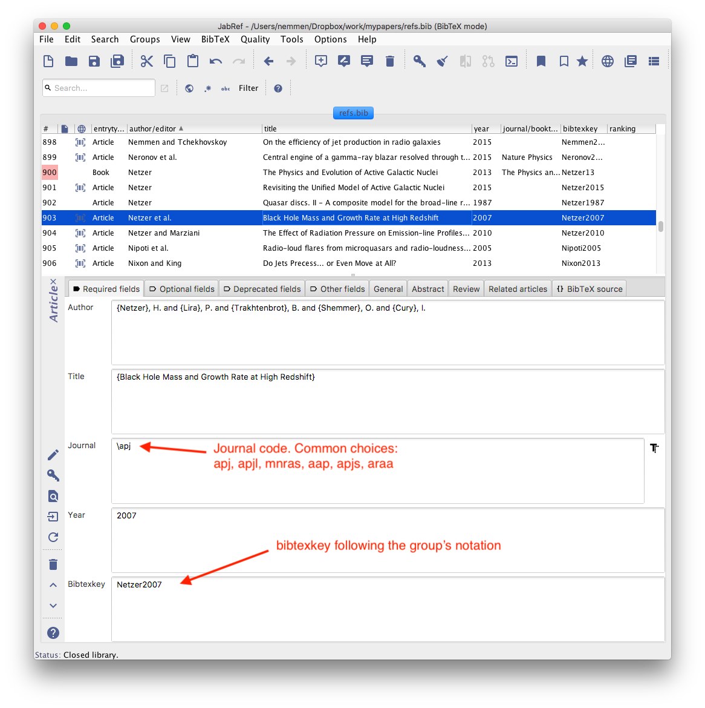
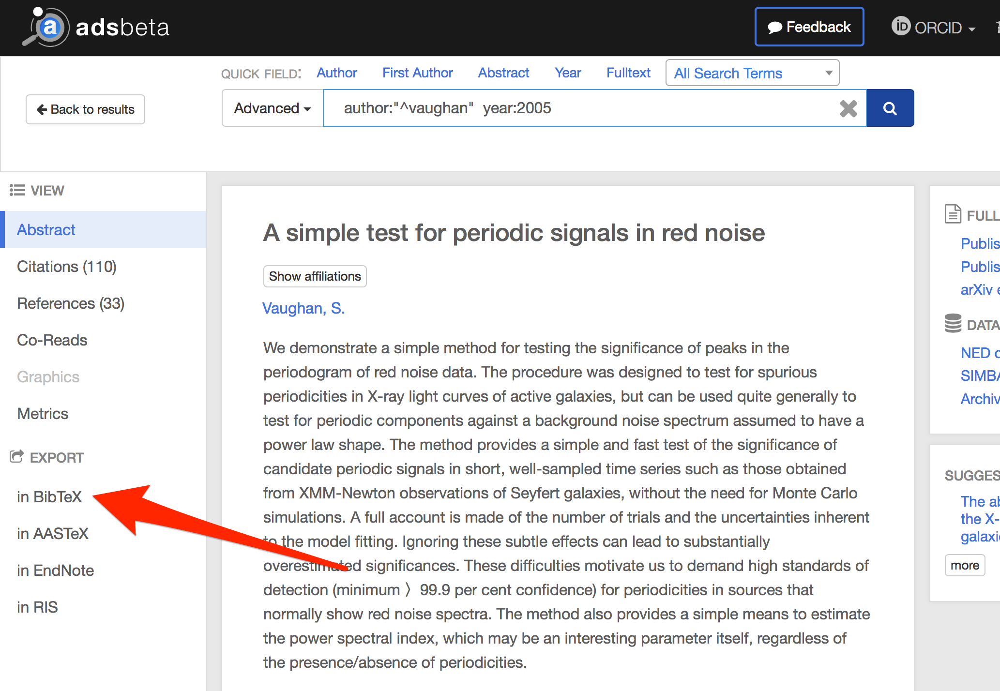
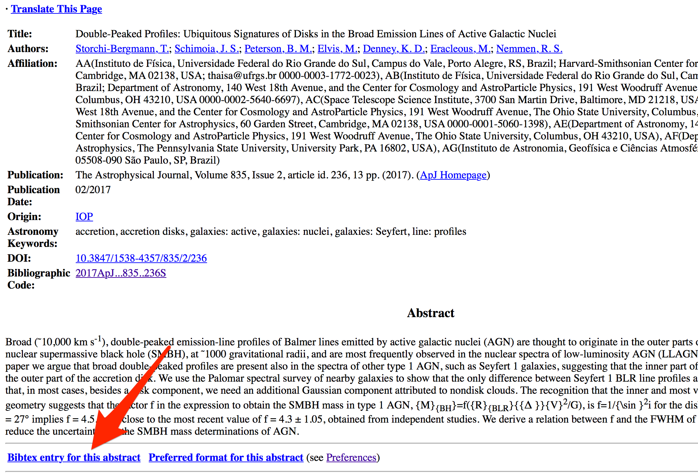

Black hole group BibTeX database
==================================

This is the BibTeX database for the [Black Hole Group](https://rodrigonemmen.com/group/) @ IAG USP, with over 1000 references in black hole and high energy astrophysics, and AI in astronomy as well as an auxiliary TeX file with abbreviations of common astrophysics journals. 

# Files

* `journals.tex` - abbreviations of journals for bibliography
* `refs.bib` - *black hole* references, bibtex format
* `AI.bib` - *AI in astronomy* references, bibtex format
* `physics.bib` - *physics* references, bibtex format

# How to use the database

Make sure the files are in the same directory as your latex document. Then simply include the following line before `\begin{document}` in your latex document:

    % Journal abbreviations \apj, \mnras etc (bibtex)
    \include{journals}	

and include the following line at the end of the document just before `\end{document}`:

    \bibliography{refs}    

# Contributing to the database

Everybody is welcome to add references to the database and keep it growing. :smile:

Just add papers to the database in the usual bibtex way, commit your file and push to this repo. 

### Guidelines for updating the bibtex file

#### 1. Keep the consistent notation for `bibtexkey` and journal code

The notation for the `bibtexkey` field is *Last Name of First Author + last two digits of year of publication*. 

Examples: 

> Yuan, F.; Lin, J.; Wu, K. & Ho, L. C.
A magnetohydrodynamical model for the formation of episodic jets. MNRAS, 2009, 395, 2183

becomes

* bibtexkey = `Yuan2009`
* journal = \apj

> F Yusef-Zadeh, R. Arendt, H. Bushouse, W. Cotton, D. Haggard, M. W. Pound, D. A. Roberts, M. Royster, and M. Wardle. A 3 pc SCALE JET-DRIVEN OUTFLOW FROM SGR A*. The Astrophysical Journal Letters, 2012, Volume 758, Number 1

becomes

* bibtexkey = `Yusef-Zadeh2012`
* journal = \apjl

Common choices for the journal tag are: `\apj, \apjl, \mnras, \aap, \apjs, \araa`. Full list available in the `journals.tex` file.

#### 2. Recommended apps for managing the database


Some useful apps you can use to manage the database: 

- [jabref](http://www.jabref.org)
- [mendeley](https://www.mendeley.com/newsfeed/)
- [bibdesk](http://bibdesk.sourceforge.net) (macOS only)
- [papers](http://www.papersapp.com) (macOS only)

Here is a screenshot of jabref and its convenient interface for managing references.



#### 3. Easily grabbing bibtex info from a paper in NASA ADS, arXiv or DOI

Every search engine for references includes ways of copying the bibtex info for a paper.

 

  

Alternatively, for convenience, it is suggested to use the [adspaste](https://github.com/rsnemmen/adspaste) command-line tool. Some examples:

```
adspaste 1998ApJ...500..525S	# from ADS
adspaste 10.1093/mnras/stv260	# from DOI
adspaste 1411.4682	# from arXiv
```
In each case, the full bibtex info will be copied to the clipboard and ready to be inserted in database.


&nbsp;

---

 

New to Git? [Check this out](https://github.com/rsnemmen/Git-for-busy-people).

[Black Hole Group](https://blackholegroup.org/).

